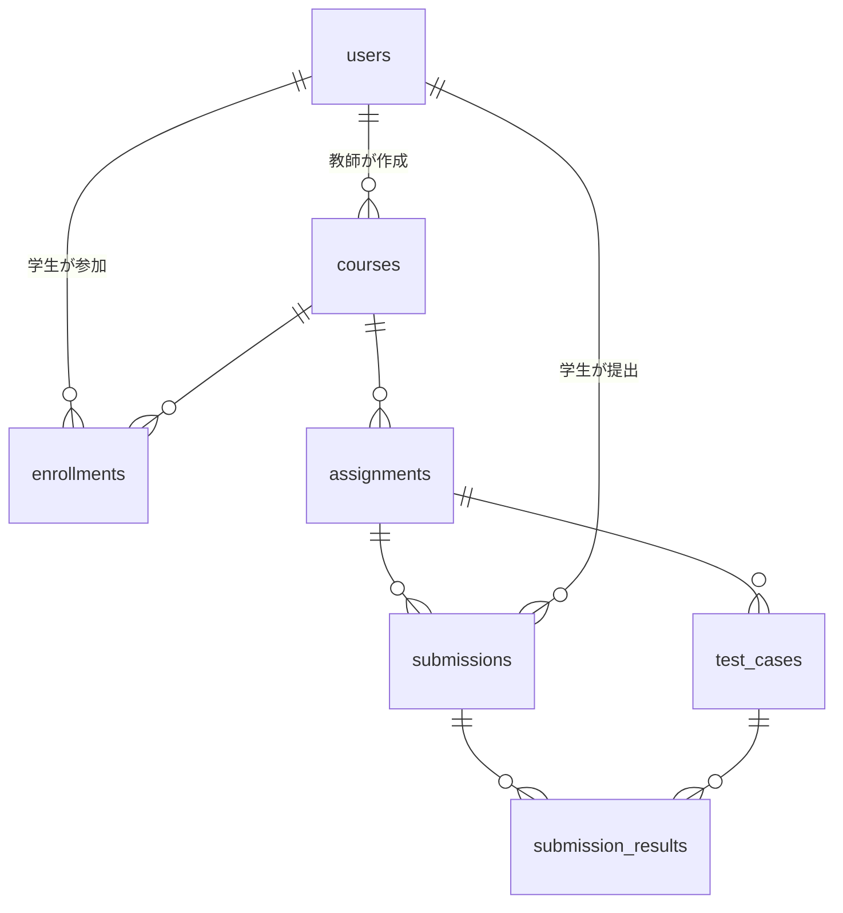

# DB設計

**対象**: プログラミング課題採点DX化アプリ MVP
**DB**: PostgreSQL

## 1. 設計方針

- ユーザー（オーナー・教師・学生）は `users` テーブルに統合し、`role` で区別する。
- 学生と授業の参加関係は多対多なので、中間テーブル `enrollments` で表現。
- 提出は複数回可能なので `submissions` に全提出を記録し、期限終了時の最終提出を採点対象として識別する。
- テストケースごとの判定結果は `submission_results` に保持。
- 成績（授業ごとの点数の和 / 満点）は保存せず、最終提出の点数から集計で算出する。
- 配点はテストケース単位（`test_cases.score`）で管理し、課題の満点はその合計から導出する（`assignments.max_score` は持たない）。
- 自動採点スコア（`auto_score`）と最終スコア（`score`）を分離し、教師が修正しても元の自動採点値を保持する。
- 提出には実際に使用した言語（`submissions.language`）を記録する。
- 教師コメントは提出に1件（`submissions.teacher_comment`）として持ち、専用テーブルは設けない。

## 2. ER図

## 3. テーブル一覧

| テーブル | 説明 |
| --- | --- |
| `users` | オーナー・教師・学生を role で区別して管理 |
| `courses` | 授業。招待コードを保持 |
| `enrollments` | 学生と授業の参加関係（中間テーブル） |
| `assignments` | 課題 |
| `test_cases` | 課題に紐づくテストケース（in / out） |
| `submissions` | 学生の提出（複数回分を記録） |
| `submission_results` | 提出×テストケースごとの判定結果（実行時間・メモリ含む） |

## 4. テーブル定義

### 4.1 `users` ユーザー

| カラム | 型 | 制約 | 説明 |
| --- | --- | --- | --- |
| `id` | BIGSERIAL | PK | ユーザーID |
| `name` | VARCHAR(255) | NOT NULL | 氏名 / 表示名 |
| `email` | VARCHAR(255) | UNIQUE, NOT NULL | ログイン用メール |
| `password_hash` | VARCHAR(255) | NOT NULL | ハッシュ化パスワード |
| `role` | VARCHAR(16) | NOT NULL, CHECK (OWNER/TEACHER/STUDENT) | ロール |
| `created_at` | TIMESTAMPTZ | NOT NULL, DEFAULT now() | 作成日時 |
| `updated_at` | TIMESTAMPTZ | NOT NULL, DEFAULT now() | 更新日時 |

### 4.2 `courses` 授業

| カラム | 型 | 制約 | 説明 |
| --- | --- | --- | --- |
| `id` | BIGSERIAL | PK | 授業ID |
| `name` | VARCHAR(255) | NOT NULL | 授業名 |
| `teacher_id` | BIGINT | FK → users.id, NOT NULL | 作成した教師 |
| `invite_code` | VARCHAR(32) | UNIQUE, NOT NULL | 授業参加用招待コード |
| `created_at` | TIMESTAMPTZ | NOT NULL, DEFAULT now() | 作成日時 |
| `updated_at` | TIMESTAMPTZ | NOT NULL, DEFAULT now() | 更新日時 |

### 4.3 `enrollments` 授業参加

| カラム | 型 | 制約 | 説明 |
| --- | --- | --- | --- |
| `id` | BIGSERIAL | PK | ID |
| `course_id` | BIGINT | FK → courses.id, NOT NULL | 授業 |
| `student_id` | BIGINT | FK → users.id, NOT NULL | 参加学生 |
| `joined_at` | TIMESTAMPTZ | NOT NULL, DEFAULT now() | 参加日時 |
| （複合制約） | — | UNIQUE (course_id, student_id) | 同一授業への重複参加を防止 |

### 4.4 `assignments` 課題

| カラム | 型 | 制約 | 説明 |
| --- | --- | --- | --- |
| `id` | BIGSERIAL | PK | 課題ID |
| `course_id` | BIGINT | FK → courses.id, NOT NULL | 所属授業 |
| `title` | VARCHAR(255) | NOT NULL | 課題名 |
| `description` | TEXT | | 課題の内容 |
| `language` | VARCHAR(32) | NOT NULL | 使用言語名 |
| `deadline` | TIMESTAMPTZ | NOT NULL | 提出期限 |
| `is_published` | BOOLEAN | NOT NULL, DEFAULT false | 公開 / 非公開 |
| `created_at` | TIMESTAMPTZ | NOT NULL, DEFAULT now() | 作成日時 |
| `updated_at` | TIMESTAMPTZ | NOT NULL, DEFAULT now() | 更新日時 |

### 4.5 `test_cases` テストケース

| カラム | 型 | 制約 | 説明 |
| --- | --- | --- | --- |
| `id` | BIGSERIAL | PK | テストケースID |
| `assignment_id` | BIGINT | FK → assignments.id, NOT NULL | 所属課題 |
| `input` | TEXT | NOT NULL | 入力（in） |
| `expected_output` | TEXT | NOT NULL | 期待出力（out） |
| `display_order` | INT | NOT NULL, DEFAULT 0 | 表示・実行順 |
| `score` | INT | NOT NULL, DEFAULT 0 | このテストケースの配点 |
| `created_at` | TIMESTAMPTZ | NOT NULL, DEFAULT now() | 作成日時 |

### 4.6 `submissions` 提出

| カラム | 型 | 制約 | 説明 |
| --- | --- | --- | --- |
| `id` | BIGSERIAL | PK | 提出ID |
| `assignment_id` | BIGINT | FK → assignments.id, NOT NULL | 対象課題 |
| `student_id` | BIGINT | FK → users.id, NOT NULL | 提出した学生 |
| `code` | TEXT | NOT NULL | 提出コード |
| `language` | VARCHAR(32) | NOT NULL | 提出時に実際に使用した言語 |
| `auto_score` | INT | NOT NULL, DEFAULT 0 | ジャッジサーバーが算出した自動採点点数 |
| `score` | INT | NOT NULL, DEFAULT 0 | 最終点数（教師修正後はこちらが優先。初期値は auto_score と同値） |
| `status` | VARCHAR(16) | NOT NULL | ジャッジ進行・総合状態（取りうる値は「5. 設計上の補足」参照） |
| `is_score_overridden` | BOOLEAN | NOT NULL, DEFAULT false | 教師による採点修正済みか |
| `teacher_comment` | TEXT | | 教師による提出へのコメント（1件） |
| `submitted_at` | TIMESTAMPTZ | NOT NULL, DEFAULT now() | 提出日時（期限内最終提出の判定に使用） |

### 4.7 `submission_results` テストケース判定結果

| カラム | 型 | 制約 | 説明 |
| --- | --- | --- | --- |
| `id` | BIGSERIAL | PK | ID |
| `submission_id` | BIGINT | FK → submissions.id, NOT NULL | 対象提出 |
| `test_case_id` | BIGINT | FK → test_cases.id, NOT NULL | 対象テストケース |
| `status` | VARCHAR(8) | NOT NULL | 判定（AC/WA/RE/TLE 等） |
| `actual_output` | TEXT | | 実際の出力 |
| `execution_time_ms` | INT | | 実行時間（ミリ秒） |
| `memory_kb` | INT | | 使用メモリ（KB） |
| `created_at` | TIMESTAMPTZ | NOT NULL, DEFAULT now() | 作成日時 |

## 5. 設計上の補足

- **成績の集計**: 授業ごとの成績は、各課題の「期限内最終提出の score の和 / 課題のテストケース配点（test_cases.score）の合計」でクエリ集計する（満点もテーブルとしては保存せず集計で算出）。
- **最終提出の特定**: `submissions` を student_id × assignment_id で絞り込み、submitted_at が deadline 以前の最新レコードを採点対象とする。高頻度に参照する場合は assignments 単位の最終提出を示すフラグ列の追加も検討。
- **推奨INDEX**: `enrollments(student_id)`, `assignments(course_id)`, `submissions(assignment_id, student_id, submitted_at)`, `submission_results(submission_id)` など。
- **submissions.status の取りうる値**: `PENDING`（採点待ち）/ `JUDGING`（採点中）/ `JUDGED`（採点完了）/ `CE`（コンパイルエラー）/ `ERROR`（ジャッジ失敗・内部エラー）。ジャッジの進行・総合状態を表す軸で、テストケース単位の判定（`submission_results.status`: AC/WA/TLE/RE 等）とは別軸として扱う。
- **将来拡張**: 実行時間・メモリの「制限」設定、不正検知、LLM採点などは assignments / submission_results へのカラム追加で対応可能（実行時間・メモリの実測値は submission_results に追加済み）。
