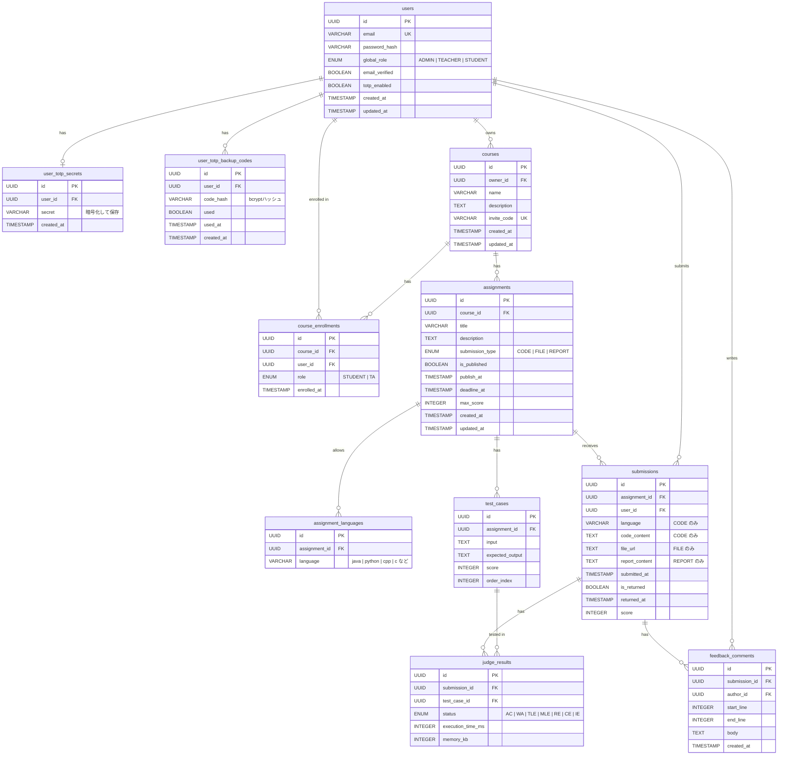

# ER図

## エンティティ関連図

---

## テーブル補足

### `users`
- `global_role` が `TEACHER` のアカウントは `ADMIN` のみ作成可能
- `email_verified` が `false` の場合はログイン不可
- `totp_enabled = true` の場合、ログイン時に TOTP コード入力が必要

### `user_totp_secrets`
- `users` と 1対1。TOTP 有効化時に生成、無効化時に削除
- `secret` はサーバーサイドで暗号化して保存

### `user_totp_backup_codes`
- 有効化時に8件生成。1件使用ごとに `used = true` にする
- `code_hash` は bcrypt ハッシュで保存（平文は表示時のみ）
- 再生成時は既存レコードをすべて削除して新規8件を作成

### `courses`
- `owner_id` は `global_role = TEACHER` のユーザーのみ
- `invite_code` は教師が再発行可能。再発行時に上書きされ、古いコードは無効

### `course_enrollments`
- 授業オーナー（TEACHER）はこのテーブルには登録しない
- `role` は初期値 `STUDENT`。教師が `TA` に変更可能

### `assignments`
- `submission_type = CODE` の場合のみ `assignment_languages` が有効
- `is_published = false` または `publish_at` が未来日時の場合、受講生には非表示
- `max_score` は `CODE` の場合 `test_cases.score` の合計と一致させる

### `submissions`
- 再提出可能。最後の提出（`submitted_at` が最新）が成績として扱われる
- `is_returned = false` の間、学生は `score` と `feedback_comments` を閲覧不可
- `submission_type = FILE / REPORT` の場合、`score` は教師・TAが手動入力

### `judge_results`
- `submission_type = CODE` のときのみ生成される
- ステータス: `AC`（正解）、`WA`（不正解）、`TLE`（時間超過）、`MLE`（メモリ超過）、`RE`（実行時エラー）、`CE`（コンパイルエラー）、`IE`（内部エラー）
- `score` は通過した `test_cases.score` の合計を `submissions.score` に反映する

### `feedback_comments`
- `submission_type = CODE` または `REPORT` のみ有効
- `author_id` は授業内ロールが `TEACHER` または `TA` のユーザーのみ
